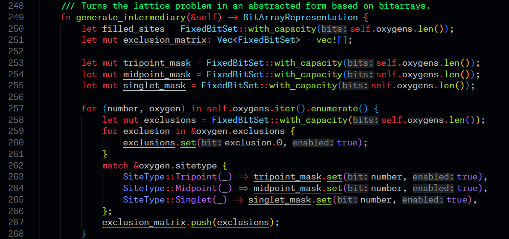
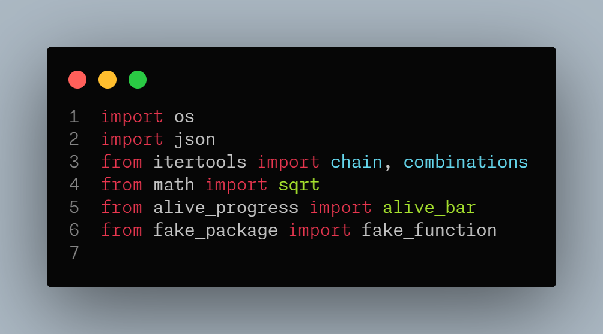
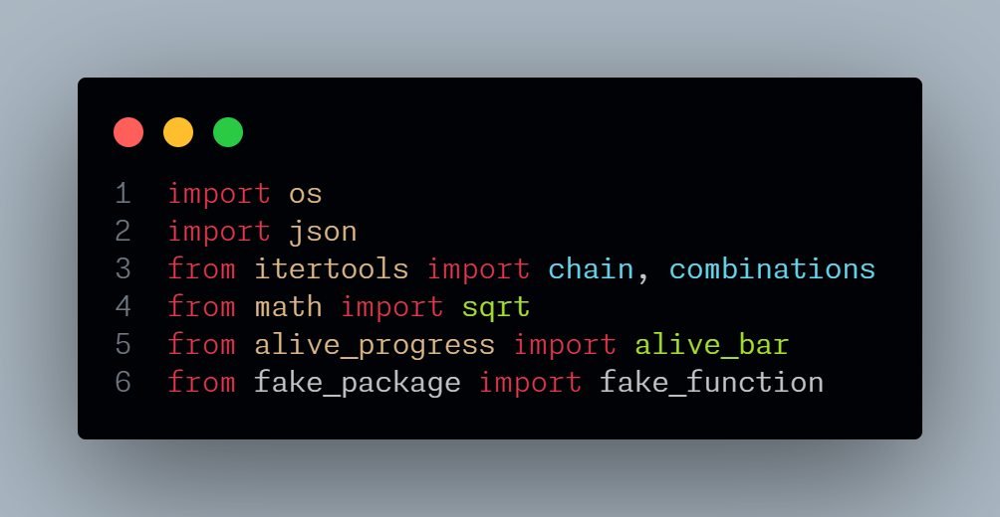
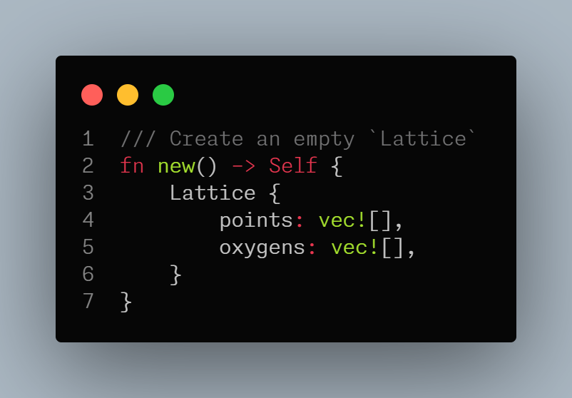
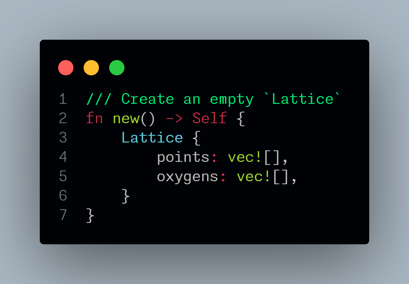
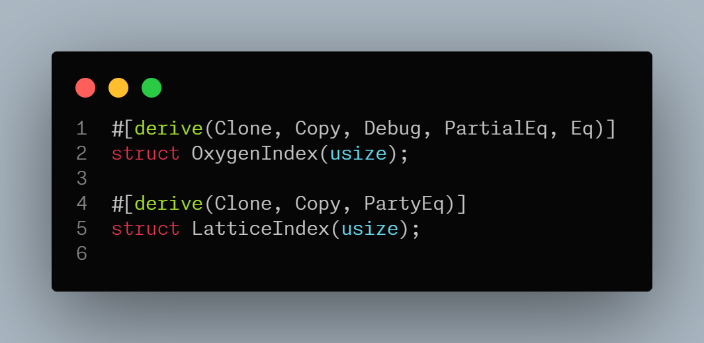
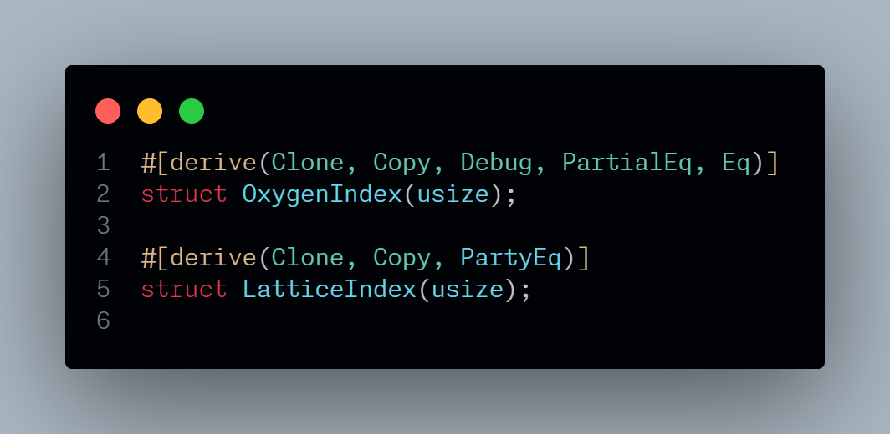
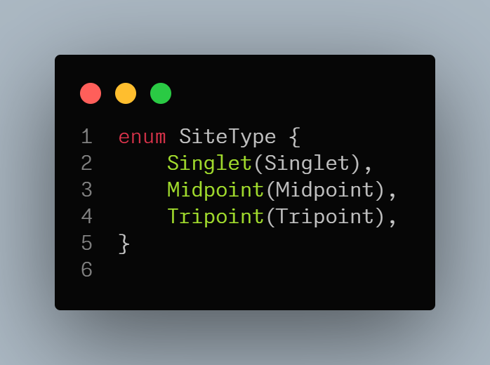
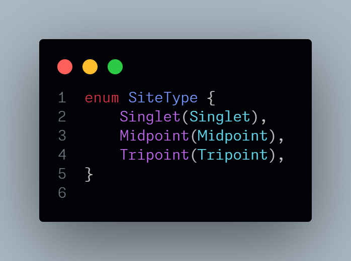

# chromodusk-classic-v4 README

This theme is a fork of the Chromodusk theme from [leelhn2345's Chromodynamics V3 Theme](https://marketplace.visualstudio.com/items?itemName=leelhn2345.chromodynamics-v3-theme) extension, but with most colors changed back to match the original [Chromodynamics Theme](https://marketplace.visualstudio.com/items?itemName=magicstack.Chromodynamics). I want to keep this theme close to the Chromodynamics theme, while improving it with new features like syntax highlighting. 

## Code samples:

A brief Rust code sample:

### Verified imports

|Chromodynamics|Chromodynamics Classic|
|:------------:|:--------------------:|
|||

Imported libraries are given a custom color, revealing misspelled or uninstalled packages. This also makes calling a function from a package easier to distinguish from calling a method from an object. (Sample from Python)

### Brilliant Docstrings

|Chromodynamics|Chromodynamics Classic|
|:------------:|:--------------------:|
|||

Docstrings are important. Now they cannot be ignored.

### (Rust) Derive 

|Chromodynamics|Chromodynamics Classic|
|:------------:|:--------------------:|
|||

Valid #derive statements will get colored, revealing e.g. spelling mistakes.

### (Rust) Enums repainted

|Chromodynamics|Chromodynamics Classic|
|:------------:|:--------------------:|
|||

## Forks

This theme is a fork of [Chromodynamics V3 Theme](https://marketplace.visualstudio.com/items?itemName=leelhn2345.chromodynamics-v3-theme), which is a fork of [ChromodynamicsV2 Theme](https://marketplace.visualstudio.com/items?itemName=yousefabuz17.ChromodynamicsV2), which is a fork of [Chromodynamics Theme](https://marketplace.visualstudio.com/items?itemName=magicstack.Chromodynamics), which is a fork of [Monokai Dark Soda](https://marketplace.visualstudio.com/items?itemName=AdamCaviness.theme-monokai-dark-soda), which is a fork of [Monokai Night Theme](https://marketplace.visualstudio.com/items?itemName=fabiospampinato.vscode-monokai-night).